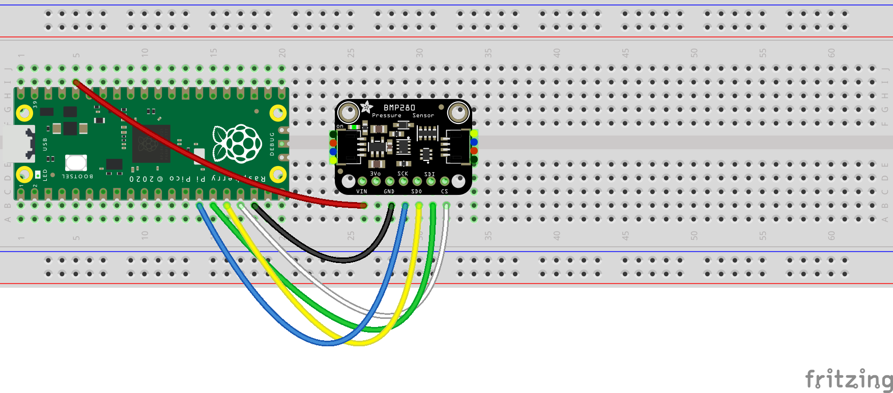

# pico-bmp280

This is a MicroPython library for the Raspberry Pi Pico and allows communicating with the 
[BMP280 pressure sensor](https://www.bosch-sensortec.com/products/environmental-sensors/pressure-sensors/bmp280/) 
through the Serial Peripheral Interface bus protocol.

## Example
```python
from machine import Pin, SPI
from utime import sleep
from bmp280 import BMP280

SPI_SCK = Pin(10)
SPI_TX = Pin(11)
SPI_RX = Pin(12)
SPI_CSn = Pin(13, Pin.OUT, value=1)

spi = SPI(1, sck=SPI_SCK, mosi=SPI_TX, miso=SPI_RX)
bmp280 = BMP280(spi, SPI_CSn)

while True:
    readout = bmp280.read_measurements()
    print(f"Temperature: {readout['t']} °C, pressure: {readout['p']} hPa.")
    sleep(1)
```
This is the circuit for the example code above. It uses the [Adafruit BMP280](https://www.adafruit.com/product/2651) 
breakout board.



The default settings use the *weather monitoring* settings as specified 
by Bosch in the [datasheet](https://www.bosch-sensortec.com/products/environmental-sensors/pressure-sensors/bmp280/#documents)
(see table 15 on page 19). The configuration can be changed by overriding the defaults set in `BMP280Configuration`. 
The next example configures the BMP280 for *indoor navigation*:
```python
from bmp280 import BMP280, BMP280Configuration

config = BMP280Configuration()
config.power_mode = BMP280Configuration.POWER_MODE_NORMAL
config.pressure_oversampling = BMP280Configuration.PRESSURE_OVERSAMPLING_16X
config.temperature_oversampling = BMP280Configuration.TEMPERATURE_OVERSAMPLING_2X
config.filter_coefficient = BMP280Configuration.FILTER_COEFFICIENT_16
config.standby_time = BMP280Configuration.STANDBY_TIME__5_MS

bmp280 = BMP280(spi, SPI_CSn, config)
```