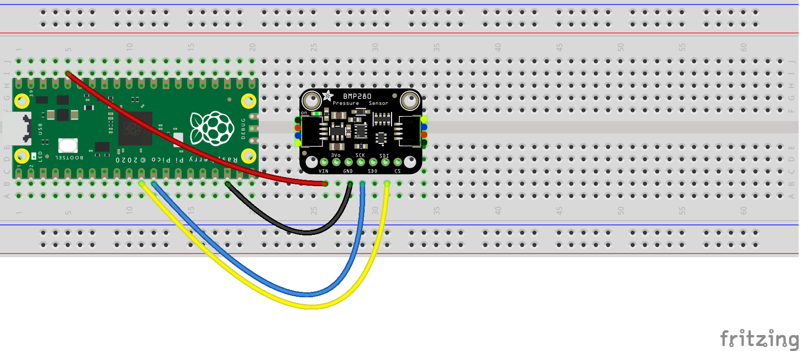

# pico-bmp280

This is a MicroPython library for the Raspberry Pi Pico and allows communicating with the 
[BMP280 pressure sensor](https://www.bosch-sensortec.com/products/environmental-sensors/pressure-sensors/bmp280/) 
through the SPI and I2C protocols.

## SPI Example
```python
from machine import Pin, SPI
from utime import sleep

from bmp280 import BMP280SPI, BMP280Configuration

spi1_sck = Pin(10)
spi1_tx = Pin(11)
spi1_rx = Pin(12)
spi1_csn = Pin(13, Pin.OUT, value=1)
spi1 = SPI(1, sck=spi1_sck, mosi=spi1_tx, miso=spi1_rx)
bmp280_spi = BMP280SPI(spi1, spi1_csn)

while True:
    readout = bmp280_spi.measurements
    print(f"Temperature: {readout['t']} °C, pressure: {readout['p']} hPa.")
    sleep(1)
```
This is the circuit for the example code above. It uses the [Adafruit BMP280](https://www.adafruit.com/product/2651) 
breakout board.


## I2C Example
```python
from machine import Pin, I2C
from utime import sleep

from bmp280 import BMP280I2C, BMP280Configuration

i2c0_sda = Pin(8)
i2c0_scl = Pin(9)
i2c0 = I2C(0, sda=i2c0_sda, scl=i2c0_scl, freq=400000)
bmp280_i2c = BMP280I2C(0x77, i2c0)  # address may be different

while True:
    readout = bmp280_i2c.measurements
    print(f"Temperature: {readout['t']} °C, pressure: {readout['p']} hPa.")
    sleep(1)
```



## Customizing configuration
The default settings use the *weather monitoring* settings as specified 
by Bosch in the [datasheet](https://www.bosch-sensortec.com/products/environmental-sensors/pressure-sensors/bmp280/#documents)
(see table 15 on page 19). The configuration can be changed by overriding the defaults set in `BMP280Configuration`.

The next example configures the BMP280 for *indoor navigation*:
```python
from bmp280 import BMP280I2C, BMP280Configuration

config = BMP280Configuration()
config.power_mode = BMP280Configuration.POWER_MODE_NORMAL
config.pressure_oversampling = BMP280Configuration.PRESSURE_OVERSAMPLING_16X
config.temperature_oversampling = BMP280Configuration.TEMPERATURE_OVERSAMPLING_2X
config.filter_coefficient = BMP280Configuration.FILTER_COEFFICIENT_16
config.standby_time = BMP280Configuration.STANDBY_TIME__5_MS

bmp280_i2c = BMP280I2C(0x76, i2c0, config)
```